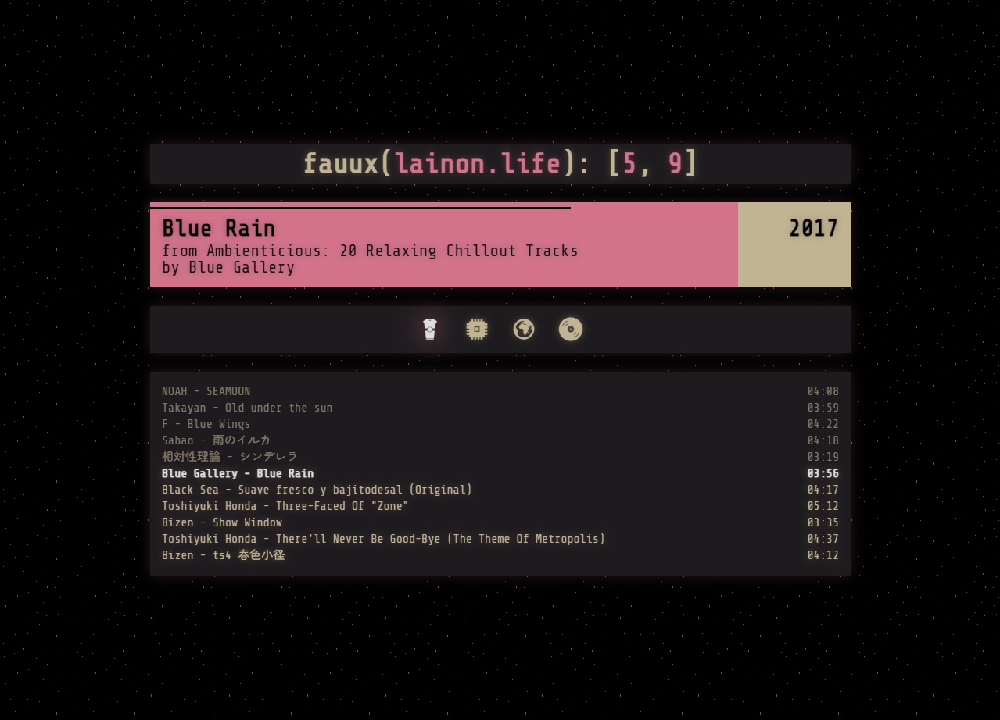

# fauuxon.life

An alternative, [fauux](https://fauux.neocities.org)-inspired interface for the [lainon.life](https://lainon.life) web radio.

**NOTE:** lainon.life does *not* allow CORS, so you will need to somehow enforce it yourself. If you don't, fetching the necessary data will fail and a warning will be displayed after selecting a channel.

## Credit

- Radio, API: **Michael Walker** (barrucadu)
  - [GitHub](https://github.com/barrucadu/lainonlife)
  - [Website](https://www.barrucadu.co.uk)
  - [PayPal](https://www.paypal.com/paypalme/barrucadu)

- Backgrounds, color scheme: **fauux**
  - [Website](https://fauux.neocities.org)